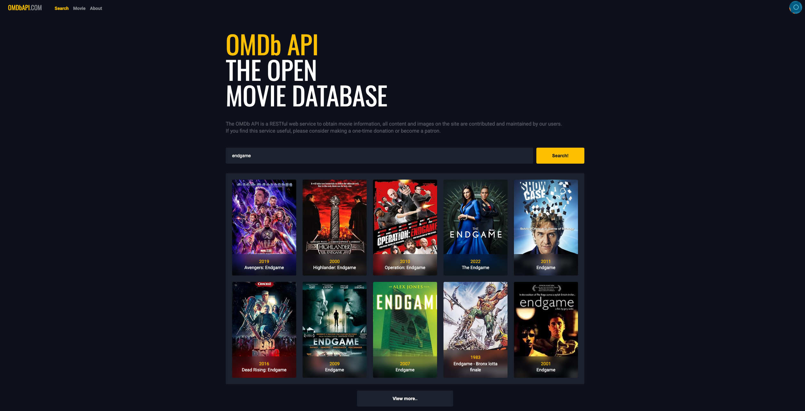
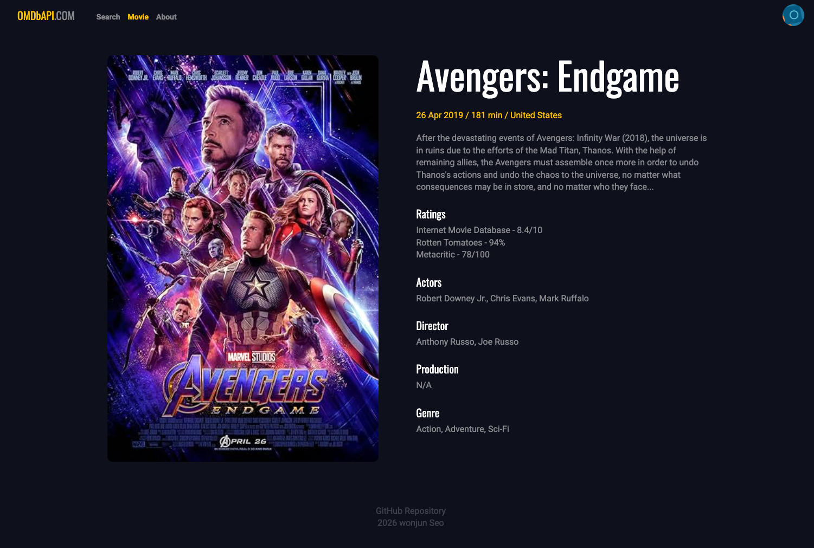
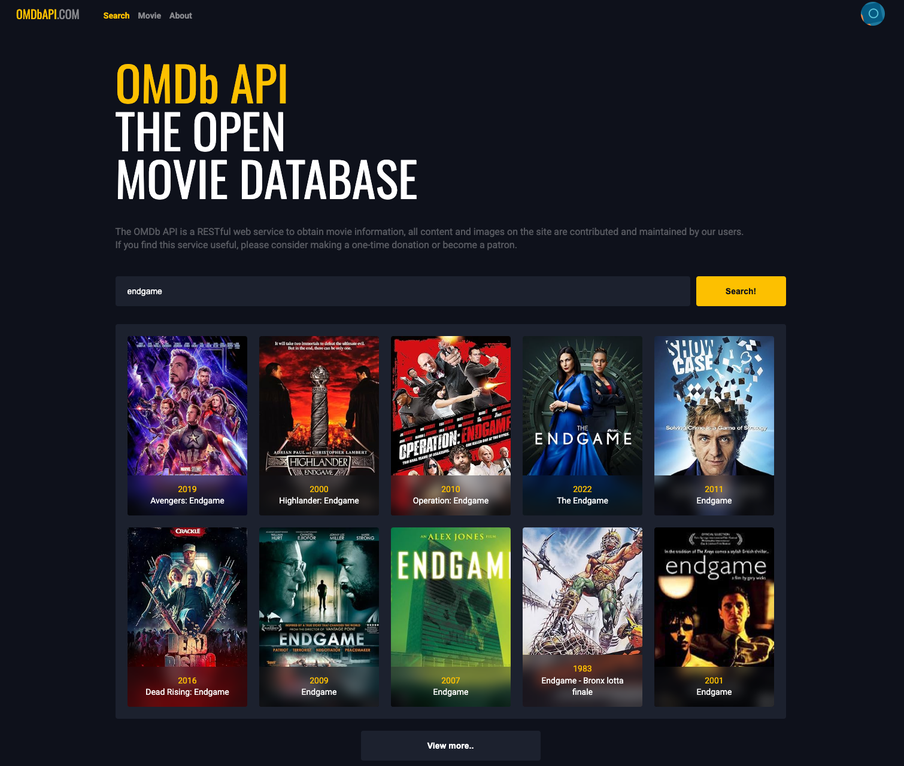
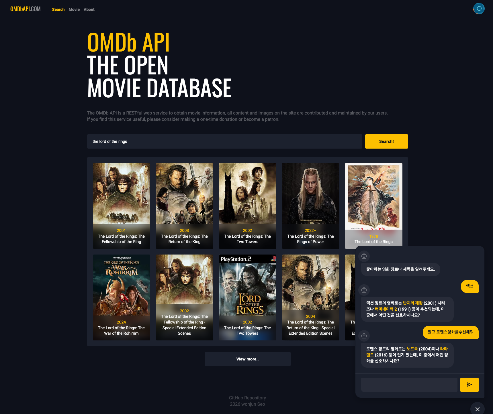
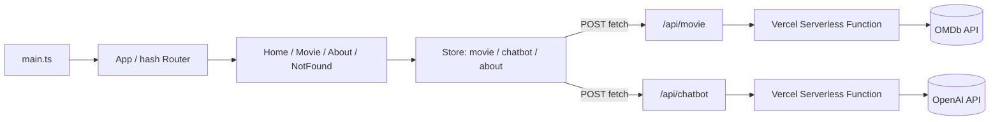

# omDB Movie App

프레임워크(React/Vue) 없이 TypeScript만으로 만든 영화 검색 SPA. OMDb API로 영화를 검색·조회하고, OpenAI 기반 챗봇이 취향에 맞는 영화를 추천해준다.

배포: [배포 URL](https://omdb-movie-7xo0bcz1y-wonjuns-s-dev.vercel.app/#/) 

**Stack**: TypeScript(Vanilla SPA), Parcel, Vercel Serverless Functions, OMDb API, OpenAI API

**기간 / 인원**: 2026.07.14 – 2026.07.15 (2일) · 1인 개발

---

## 프로젝트 소개

React 같은 프레임워크에 기대지 않고, 컴포넌트 렌더링/상태 관리/라우팅을 직접 구현하며 SPA의 동작 원리를 이해하기 위해 만든 프로젝트다. OMDb API로 영화를 검색하고, OpenAI를 붙인 챗봇이 대화로 영화를 추천해준다.

- 프레임워크 없이 직접 구현한 `Component` / `Store` / `Router` 코어 위에서 동작하는 SPA
- OMDb API 연동 영화 검색, 무한 "더보기" 페이지네이션, 상세 페이지(스켈레톤 UI 포함)
- OpenAI 기반 AI 챗봇 — 답변 속 영화 제목을 파싱해 클릭 시 바로 검색으로 연결
- Vercel 서버리스 함수를 BFF로 두어 OMDb/OpenAI API 키를 클라이언트에 노출하지 않음

**왜 만들었는가**
평소 React로만 개발하다 보니 "상태가 바뀌면 화면이 왜/어떻게 다시 그려지는지"를 블랙박스로 여기고 있었다. 직접 반응형 스토어와 라우터를 만들어보면서 프레임워크가 대신 해주던 문제들을 스스로 풀어보고 싶어 시작한 사이드 프로젝트다.

**성과 / 결과**
2일 만에 커스텀 SPA 코어 + 영화 검색/상세 + AI 챗봇 + 반응형 레이아웃 + Vercel 배포까지 1인으로 완주. 배포 과정에서 TypeScript 버전 호환 이슈를 직접 원인 분석해 해결함 (아래 트러블슈팅 참고).

---

## 스크린샷

| 홈 – 영화 검색 결과 | 영화 상세 페이지 |
|---|---|
|  |  |

| 홈 – 반응형 레이아웃 | AI 챗봇 영화 추천 |
|---|---|
|  |  |

---

## 기술 스택

| 구분 | 기술 | 선택 이유 |
|---|---|---|
| Frontend | TypeScript (Vanilla, 커스텀 미니 SPA 코어) | React/Vue 없이 컴포넌트 렌더링·반응형 상태·라우팅을 직접 구현해 SPA 동작 원리를 체득하기 위해 |
| Bundler | Parcel | 별도 설정 없이 빠르게 TS를 번들링하고 dev 서버를 띄우기 위해 |
| Backend (BFF) | Vercel Serverless Functions | OMDb/OpenAI API 키를 클라이언트 번들에 노출하지 않기 위한 프록시 |
| 외부 API | OMDb API | 영화 검색 및 상세 정보 조회 |
| AI | OpenAI `gpt-3.5-turbo` | 사용자 취향 기반 대화형 영화 추천 챗봇 |
| Deploy | Vercel | 정적 프론트엔드 + 서버리스 함수를 한 번에 배포 |
| Formatting | Prettier | 코드 스타일 통일 |

**이번 프로젝트에서 처음 써본 방식**: React/Vue 없이 만든 커스텀 SPA 코어(`src/core/core.ts`)
→ `Component`(렌더 생명주기), `Object.defineProperty` getter/setter + pub-sub 기반 반응형 `Store`, 해시 기반 `Router`를 직접 설계·구현했다. Vue의 `Object.defineProperty` 방식 반응성이 배열 변경 감지에 취약해 Vue3에서 `Proxy`로 옮겨간 이유를 실제로 구현하며 체감할 수 있었다.

---

## 아키텍처



설계 포인트: 클라이언트는 항상 `/api/*` 상대 경로만 호출하고, 실제 외부 API 키는 서버리스 함수(`api/movie.ts`, `api/chatbot.ts`) 안 환경 변수에서만 사용해 프론트 번들에 시크릿이 섞이지 않도록 했다.

---

## 주요 기능

**1. 영화 검색 & 더보기 페이지네이션**
`Search` 컴포넌트에서 입력한 제목으로 OMDb를 검색하고, `MovieList`/`MovieItem`이 결과를 그리드로 렌더링한다. `pageMax`를 응답의 `totalResults`로 계산해 `MovieListMore` 버튼을 조건부로 노출한다.

**2. 영화 상세 페이지**
상세 데이터를 불러오는 동안 스켈레톤 UI를 먼저 그리고, 로드가 끝나면 포스터(`SX300` → `SX700`로 치환해 고화질 요청)와 평점·배우·감독 정보를 채운다.

**3. AI 챗봇 영화 추천**
플로팅 챗 위젯에서 대화로 영화를 추천받는다. 챗봇 응답 속 영화 제목을 클릭하면 검색창에 자동 입력되고 즉시 검색까지 실행된다.

**4. 반응형 레이아웃**
1200px / 720px / 600px 브레이크포인트로 헤더, 영화 그리드, 상세 페이지, 챗봇 위젯 레이아웃을 조정했다.

---

## 기술적 의사결정 & 트러블슈팅

**1. 프레임워크 없이 반응형 상태 관리 구현하기**
- 문제: React/Vue 없이 상태가 바뀔 때 관련 컴포넌트만 다시 그리는 구조가 필요했다.
- 원인: 별도 라이브러리 없이 "상태 변경 감지"를 직접 만들어야 했다.
- 해결: `Store` 클래스에서 상태 객체의 각 key를 `Object.defineProperty`로 감싸 getter/setter를 만들고, setter가 호출될 때 `subscribe`로 등록된 콜백들을 실행하는 pub-sub 구조를 구현했다. `MovieList`, `Chatbot` 등 컴포넌트는 생성자에서 관심 있는 key를 구독해 자신의 `render()`를 재호출한다.
- 결과: 외부 상태관리 라이브러리 없이 `movie`/`chatbot`/`about` 세 도메인의 상태를 동일한 패턴으로 관리.

**2. LLM 응답에서 영화 제목만 안전하게 추출하기**
- 문제: 챗봇이 자연어로 영화를 추천하면, 어떤 부분이 "영화 제목"인지 프론트에서 구분할 수 없었다.
- 원인: 자유 형식의 자연어 응답을 그대로 정규식으로 파싱하면 신뢰도가 낮다.
- 해결: `api/chatbot.ts`의 system prompt에서 영화 제목을 항상 `{{한글제목//영어제목}}(연도)` 형식으로 감싸도록 강제하고, 이 포맷을 따르는 few-shot 예시(장르별 추천 응답) 10개를 시스템 메시지에 미리 넣어 포맷 준수율을 높였다. 프론트에서는 `/{{(.*?)\/\/(.*?)}}/g` 정규식으로 이 포맷만 캡처해 클릭 가능한 `span`으로 치환한다.
- 결과: 챗봇이 추천한 영화를 클릭하면 바로 검색 결과와 연결되는 흐름을 안정적으로 구현.

**3. API 키를 클라이언트에 노출하지 않기**
- 문제: 프론트에서 OMDb/OpenAI를 직접 호출하면 API 키가 번들에 그대로 노출된다.
- 해결: `api/movie.ts`, `api/chatbot.ts` Vercel 서버리스 함수를 BFF로 두고, 클라이언트는 `/api/movie`, `/api/chatbot`만 호출하도록 했다. 키는 서버 환경 변수(`.env`)에서만 읽는다.
- 결과: 클라이언트 번들에 시크릿이 포함되지 않음.

**4. Vercel 배포 시 TypeScript 버전 호환성 문제**
- 문제: 로컬에서는 문제없이 동작하던 프로젝트가 Vercel 배포 빌드에서 실패했다.
- 원인: `package.json`에 `typescript: "^7.0.2"`가 지정되어 있었는데, 이는 Vercel의 Node 빌드 환경/`@vercel/node` 타입 빌더가 아직 지원하지 않는 버전이었다. 게다가 lockfile에는 `@typescript/typescript-*` 형태의 플랫폼별 옵셔널 패키지들이 대거 포함되어 설치 단계도 불필요하게 무거웠다.
- 해결: `typescript`를 `5.9.3`으로 다운그레이드하고, `package-lock.json`을 다시 생성해 플랫폼별 옵셔널 의존성을 제거했다.
- 결과: 두 번의 커밋(`c737869`, `6b448af`)으로 배포가 정상화되어 Vercel 빌드가 성공했다.

---

## 학습 로그

| 날짜 | 배운 개념 | 왜 필요했는가 |
|---|---|---|
| 2026-07-14 | `Object.defineProperty` 기반 반응형 Store 설계 | 프레임워크 없이 상태 변경 → 리렌더링 흐름을 직접 구현하려고 |
| 2026-07-14 | 해시 기반 클라이언트 라우팅 (`#/...`, `popstate`) | 서버 없이 SPA 라우팅을 처리하기 위해 |
| 2026-07-14 | Vercel 서버리스 함수로 API 키 은닉하는 BFF 패턴 | OMDb API 키를 프론트에 노출하지 않기 위해 |
| 2026-07-15 | OpenAI few-shot 프롬프트로 응답 포맷 강제하기 | 챗봇 응답에서 영화 제목을 프론트가 안정적으로 파싱하게 하려고 |
| 2026-07-15 | CSS media query 기반 반응형 레이아웃 | 뷰포트별로 헤더/그리드/챗봇 위젯 배치를 조정하려고 |
| 2026-07-15 | Vercel 빌드 환경과 TypeScript 버전 호환성 | 로컬-배포 환경 차이로 인한 빌드 실패를 진단하고 해결하려고 |

---

## 프로젝트 구조

```
omdb-movie-app/
├── api/
│   ├── movie.ts          # OMDb API 프록시 (Vercel Serverless Function)
│   └── chatbot.ts        # OpenAI API 프록시 (Vercel Serverless Function)
├── src/
│   ├── core/core.ts      # Component / Store / Router 코어
│   ├── components/       # Chatbot, Search, MovieList, MovieItem, TheHeader, TheFooter 등
│   ├── routes/            # Home, Movie, About, NotFound + 라우트 정의
│   ├── store/              # movie, chatbot, about 도메인 상태
│   ├── main.ts
│   └── main.css
├── index.html
└── vercel.json
```

---

## 실행 방법

요구 사항: Node.js 18+, npm

```bash
git clone https://github.com/wonjun-s-dev/omdb-movie-app.git
cd omdb-movie-app
npm install

# .env 파일 생성 후 아래 값 입력
# OMDB_API_KEY=발급받은_OMDb_API_키
# OPENAI_API_KEY=발급받은_OpenAI_API_키

npm run dev       # parcel dev 서버 (프론트만)
# 서버리스 함수(/api)까지 함께 테스트하려면
npm run vercel     # vercel dev
```

---

## 배포

호스팅: Vercel (정적 프론트엔드 + `api/` 서버리스 함수)
빌드/개발 명령은 `vercel.json`에서 `npm run build` / `npm run dev`로 지정되어 있어, `main` 브랜치에 push하면 Vercel이 자동으로 빌드·배포한다.

---

## 회고

**배운 점**
- 프레임워크 없이 SPA를 만들어보며, React/Vue가 대신 해결해주던 "상태-DOM 동기화", "컴포넌트 생명주기", "라우팅" 문제를 직접 설계하고 구현하면서 그 원리를 체감할 수 있었다. 특히 `Object.defineProperty` 기반 반응형 스토어를 직접 만들어보니, Vue2가 배열 `push` 등 일부 변경 감지를 못 했던 이유와 최신 프레임워크들이 `Proxy` 기반 반응성으로 옮겨간 이유를 코드로 이해하게 됐다.
- LLM을 실제 UI 로직에 연결할 때는 자연어 응답을 그대로 신뢰하고 파싱하면 안 되고, 프롬프트 엔지니어링으로 "출력 포맷 자체"를 프론트가 다루기 쉬운 구조로 강제하는 것이 실전에서 중요한 전략이라는 걸 체득했다. Few-shot 예시를 충분히 제공할수록 포맷 준수율이 크게 올라간다는 것도 직접 확인했다.
- API 키를 클라이언트에 노출하지 않기 위한 BFF(서버리스 함수) 패턴을 실제로 구성해보며, 프론트엔드와 백엔드의 책임 경계를 어디서 그어야 하는지 다시 생각해보는 계기가 됐다.
- 배포 환경(Vercel)과 로컬 개발 환경의 TypeScript 버전 차이가 실제 빌드 실패로 이어질 수 있다는 것, 그리고 이런 이슈를 해결할 때는 "에러 로그 → 의심되는 패키지 버전 → lockfile까지 함께 정리"하는 순서로 원인을 좁혀가는 디버깅 과정 자체가 좋은 학습이었다.

**아쉬운 점** (있는 그대로)
- 렌더링을 매번 `innerHTML` 전체 교체 방식으로 처리해서(Virtual DOM 없음) 상태가 바뀔 때마다 컴포넌트가 통째로 다시 그려진다. `Chatbot`처럼 입력 포커스나 스크롤 위치가 중요한 컴포넌트는 `render()` 이후 수동으로 `focus()`/`scrollTo()`를 다시 호출해 겨우 우회했는데, 근본적으로는 부분 업데이트(diffing) 구조가 필요한 부분이다.
- 사용자가 입력한 채팅 텍스트와 OpenAI 응답을 이스케이프 없이 `innerHTML`로 그대로 삽입하고 있다. 개인 학습용 프로젝트라 영향은 제한적이지만, 실 서비스였다면 XSS 관점에서 반드시 sanitize가 필요한 부분이었는데 이번엔 기능 구현 속도를 우선하며 남겨둔 기술 부채다.
- 테스트 코드가 전혀 없어서, `Store`의 페이지네이션 계산 로직이나 라우터의 정규식 매칭 같은 부분을 회귀 없이 안전하게 바꾸기 어렵다.
- 검색 API 호출에 디바운스나 캐싱이 없어 같은 검색어를 다시 조회해도 매번 새로 fetch한다. 페이지별 결과만 캐싱해도 "더보기" 이후 뒤로가기 시 불필요한 재요청을 줄일 수 있었을 것 같다.
- 2일이라는 짧은 기간에 커스텀 프레임워크 설계 + 라우팅 + 스토어 + API 연동 + AI 챗봇 + 반응형까지 욕심을 내다 보니, 네트워크 실패 시 사용자 피드백(토스트 등)이나 에러 바운더리 같은 디테일은 충분히 다듬지 못했다.

**다음 계획**
- `innerHTML`로 꽂히는 사용자/외부 데이터(채팅 메시지, 영화 상세 필드)에 대한 이스케이프 유틸을 추가해 XSS 위험을 제거한다.
- `Store` 구독 로직과 라우터 경로 매칭 함수에 대한 유닛 테스트(Vitest)를 추가한다.
- 검색 결과를 페이지 단위로 캐싱하고, 검색 입력에 debounce를 적용한다.
- `Movie`/`Chatbot` 컴포넌트를 부분 렌더링(필요한 DOM 노드만 갱신)으로 리팩토링해 포커스/스크롤 유지 문제를 근본적으로 해결한다.
- 챗봇 응답을 OpenAI 스트리밍 API로 받아 타이핑 효과를 제공한다.

---

## 향후 개선 계획

- [ ] 채팅/상세 데이터 innerHTML 삽입부 XSS 이스케이프 처리
- [ ] Store·Router 핵심 로직 유닛 테스트 작성 (Vitest)
- [ ] 검색 결과 페이지 캐싱 + 입력 debounce
- [ ] Chatbot/Movie 컴포넌트 부분 렌더링(diffing)으로 리팩토링
- [ ] 챗봇 응답 스트리밍(타이핑 효과) 적용
- [ ] GitHub Actions로 배포 전 타입체크/린트 CI 추가

---
